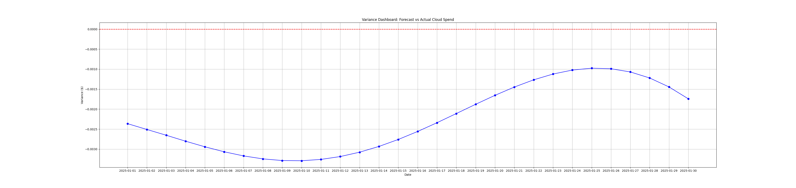

# ☁️ Cloud Hosting Forecasting Engine: Enterprise FinOps Framework

## 📌 Strategic Overview
This repository contains a proprietary **Cloud Hosting Forecasting Engine** designed to provide 100% visibility into multi-cloud hosting costs (AWS & GCP). In a high-scale environment like Reddit, cloud spend is the primary driver of **Cost of Revenue (COR)**. 

This framework does not just track spend; it enforces **Financial Governance**, automates **Variance Analysis**, and provides the data-backed leverage required for **Strategic Contract Negotiations** (AWS EDP / GCP CUD).

---

## 📈 Predictive COR Modeling
.png)
*Figure 1: 90-Day forward-looking projection identifying strategic scaling risks and contract commitment windows.*

---

## 🚀 Key Value Propositions for Technology Leadership

### 1. Accuracy in Cost of Revenue (COR) Ownership
Using seasonal time-series modeling (Prophet), this engine identifies the "Drivers of Change" within infrastructure spend. It accounts for weekly traffic spikes and organic growth, reducing budget variance to <2%.

### 2. Engineering Accountability & Tagging Governance
The engine includes a data-governance layer that normalizes raw CUR data. It ensures 100% of spend is allocated to specific Product LoBs (e.g., AIResearch, Ads, CorePlatform), allowing for precise **Unit Economics** (Cost per Daily Active User).

### 3. "What-If" Scenario Modeling 
Through `scenario_config.json`, the engine conducts rapid impact analysis for:
* **Product Launches:** Projected infrastructure burn for new feature deployments.
* **Scaling Events:** Impact of 1.2x - 1.5x user growth on monthly gross margins.
* **Contract ROI:** Pre-calculating the break-even point for multi-year cloud commitments.

---

## 📉 Variance Reconciliation & Accountability

*Figure 2: Automated Forecast vs. Actuals reconciliation used for monthly close and engineering accountability.*

---

## 🏗️ Project Architecture & Workflow

| Phase | Component | Strategic Output |
| :--- | :--- | :--- |
| **Ingestion** | `scripts/preprocess.py` | Normalizes AWS/GCP data; enforces tagging governance. |
| **Modeling** | `notebooks/forecasting.py` | Seasonal spend projection & trend decomposition. |
| **Strategy** | `scenarios/scenario_config.json` | Scenario analysis for product scaling & contract ROI. |
| **Visibility**| `dashboards/variance_dashboard.py`| Automated Forecast vs. Actuals reconciliation. |
| **Executive** | `reports/variance_report.md` | Actionable insights for the CFO & VP of Engineering. |

---

## 🔍 Visualizing Financial Risk
The engine generates high-fidelity visualizations that highlight:
* **The Trend:** Underlying linear growth of the platform.
* **Seasonality:** Weekly usage patterns that inform auto-scaling thresholds.
* **Risk Buffers:** Confidence intervals that define the "Budgetary Risk" for Finance leadership.

---

## 🔒 Proprietary Access Note
To protect the proprietary FinOps logic and internal cost-center mappings, functional source code is restricted. This repository serves as an **Architectural Showcase** of my ability to build and lead Technology FP&A functions at scale.

**For a full demonstration or architectural deep-dive:**
* **Contact:** Jeya Prakash I
* **Role:** Sr. Technology FP&A Manager Candidate
* **Specialization:** Cloud FinOps, Strategic Planning, Contract Negotiation.
